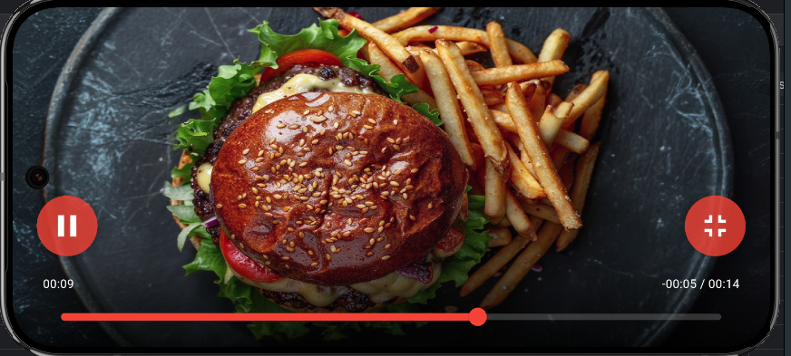

# پخش‌کننده ویدیو

## معرفی

این پروژه یک پخش‌کننده ویدیوی پیشرفته است که با استفاده از Flutter توسعه داده شده است. این برنامه قابلیت پخش ویدیو از سرور، دانلود خودکار و پخش آفلاین را دارد.

## ویژگی‌های اصلی

- 🎥 پخش ویدیو با کیفیت بالا
- 💾 دانلود خودکار ویدیوها برای پخش آفلاین
- 🔄 به‌روزرسانی خودکار محتوا هر 30 ثانیه
- 📱 رابط کاربری زیبا و کاربرپسند
- 🖥️ قابلیت نمایش تمام‌صفحه

## امکانات پخش‌کننده

- ⏯️ پخش/توقف ویدیو
- 🔄 پخش خودکار و تکرار
- ⏩ جلو/عقب بردن با نوار پیشرفت
- ⌛ نمایش زمان سپری شده و باقی‌مانده
- 🌐 پشتیبانی از پخش آنلاین و آفلاین
- 📊 نمایش پیشرفت دانلود

## قابلیت‌های فنی

- 🔒 مدیریت امن درخواست‌های HTTP
- 💽 ذخیره‌سازی محلی ویدیوها
- 🔄 مدیریت خودکار وضعیت اتصال
- 📱 سازگاری با حالت افقی و عمودی
- 🎨 رابط کاربری انیمیشن‌دار و روان

## نحوه استفاده

1. برنامه را اجرا کنید
2. پس از 3 ثانیه، به صورت خودکار وارد صفحه پخش‌کننده می‌شوید
3. ویدیو به صورت خودکار دانلود و پخش می‌شود
4. از کنترل‌های روی صفحه برای مدیریت پخش استفاده کنید

## نیازمندی‌ها

- Flutter 3.32 نسخه جدید
- اتصال به اینترنت برای دانلود اولیه ویدیو
- فضای کافی برای ذخیره‌سازی ویدیوها

## کتابخانه‌های استفاده شده

- video_player: برای پخش ویدیو
- get: برای مدیریت state
- dio: برای مدیریت درخواست‌های شبکه
- path_provider: برای مدیریت فایل‌ها

## تصاویر

### **دانلود**
